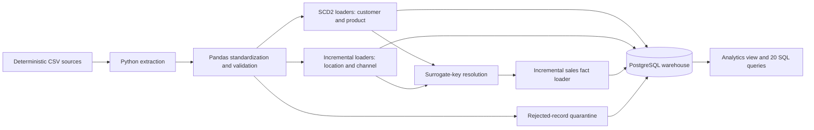

# Customer 360 Analytics Warehouse

A local PostgreSQL data warehouse that integrates deterministic customer,
product, location, channel, and sales data for dimensional reporting. I built
the pipeline to demonstrate reproducible database setup, surrogate-key
resolution, SCD Type 2 dimension handling, incremental loads, data-quality
quarantine, and SQL analytics.

## Verified scope

The checked-in sources and a clean local PostgreSQL verification run contain:

| Dataset | Rows |
| --- | ---: |
| Customers | 25,000 |
| Products | 2,000 |
| Locations | 500 |
| Channels | 5 |
| Sales orders | 400,000 |
| Calendar dates | 1,096 (2023-01-01 through 2025-12-31) |

The verification run loaded every source row, produced zero rejected rows and
zero missing dimension references, and then loaded zero additional rows on a
second complete ETL execution. All 20 retained analytical queries executed,
and all 20 automated tests passed against the isolated PostgreSQL test
database.

## Architecture



See [docs/ARCHITECTURE.md](docs/ARCHITECTURE.md) and
[docs/DATA_MODEL.md](docs/DATA_MODEL.md) for the execution path and table
grain.

## Warehouse design

`warehouse.fact_sales` has one row per source order and joins to customer,
product, location, channel, and date dimensions through surrogate keys.
Primary keys, foreign keys, business-key uniqueness constraints, partial
unique indexes for one current SCD row, and fact join indexes are created by
the versioned bootstrap.

Customer and product loaders implement SCD Type 2 behavior: a tracked change
expires the current row and inserts a new version; unchanged rows are skipped;
delete events expire the active version. Hashes are derived from controlled
source attributes rather than trusted from input.

Important limitation: sales facts resolve customer and product keys to the
version that is current when the ETL runs. The project does not perform
event-time historical attribution, so it should not be used to claim that a
sale is linked to the dimension version effective on its original order date.

## Data quality and reruns

Before loading sales, the pipeline validates required identifiers, positive
integer quantities, non-negative prices and totals, discounts from zero to
one, and amount reconciliation to a one-cent source-rounding tolerance.
Unresolved dimension or date references and invalid records are persisted to
`warehouse.rejected_records`.

Dimension current-row uniqueness and database constraints protect warehouse
integrity. Incremental loaders use business-key conflicts to skip records that
already exist. Each table load is recorded in `warehouse.etl_run_log`.

## Run locally

Requirements: Python 3.12+ and a local PostgreSQL database created specifically
for this project. The database name must end in `_dev` or `_test`.

```bash
python -m pip install -r requirements.txt
```

Copy `.env.example` to `.env` and set the local connection values. Credentials
must not be committed.

```dotenv
CUSTOMER360_DB_HOST=localhost
CUSTOMER360_DB_PORT=5432
CUSTOMER360_DB_NAME=customer360_dev
CUSTOMER360_DB_USER=customer360_app
CUSTOMER360_DB_PASSWORD=replace_with_local_password
```

The database must already exist. The initializer will not create, drop, or
reset it, and it refuses protected names, confirmation mismatches, and unknown
pre-existing `warehouse` schemas.

```bash
python scripts/init_database.py --confirm-database customer360_dev
python -m etl.pipeline
```

Run the isolated PostgreSQL integration test by supplying a database URL whose
database name ends in `_test`:

```bash
CUSTOMER360_TEST_DATABASE_URL="postgresql+psycopg2://.../customer360_test" \
python -m unittest discover -s tests -v
```

On PowerShell, set the environment variable for the current process before
running the same `python -m unittest` command.

## Repository guide

- `database/` — repeat-safe PostgreSQL schema and date-dimension bootstrap
- `etl/` — extraction, transformation, validation, SCD2, and loading code
- `sql/views.sql` — reporting view
- `sql/business_queries.sql` — 20 verified analytical and validation queries
- `tests/` — database-contract, PostgreSQL integration, SCD2, validation, and
  incremental-load tests
- `scripts/generate_large_dataset.py` — deterministic synthetic source builder

## Boundaries

This is a local portfolio system, not a deployed production service. It does
not claim cloud deployment, a production workload, a runtime performance
target, source-log CDC, streaming ingestion, or watermark-based extraction.
The GitHub Actions test workflow passed for the published repository. Database
loads use table-scoped transactions rather than one pipeline-wide transaction.
