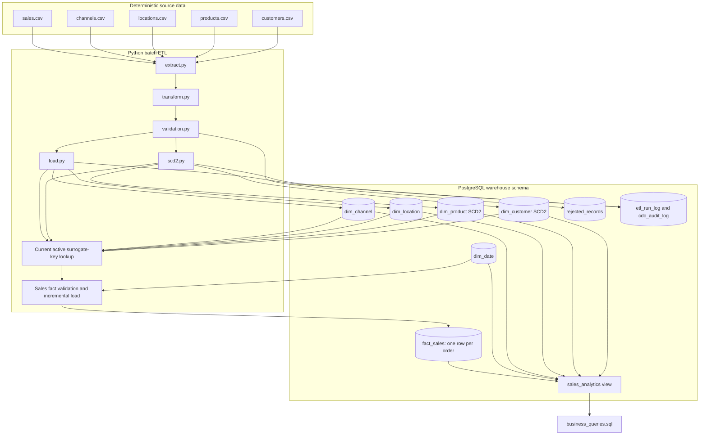

# Architecture

Customer360 is a local batch warehouse. Deterministic CSV files represent five
source domains; Python and Pandas standardize and validate them; SQLAlchemy
loads a PostgreSQL star schema; a reporting view supports the retained SQL
analysis.

## Execution path

1. `etl.pipeline` extracts all five CSV datasets and applies common
   standardization.
2. Customer and product records enter SCD2 loaders. New keys are inserted,
   changed tracked attributes create a new version, unchanged rows are skipped,
   and delete events expire the current version.
3. Location and channel rows use insert-on-conflict incremental loading.
4. Sales measures and identifiers are validated. Business identifiers are
   resolved against current, active dimension rows and the date dimension.
5. Invalid or unresolved rows are quarantined; valid orders use incremental
   insert-on-conflict loading into `fact_sales`.
6. The `sales_analytics` view joins the star schema for the 20 retained SQL
   queries.

## Attribution boundary

Customer and product lookups intentionally select the current active SCD row at
load time. This proves current-version surrogate-key handling and SCD history
creation, but it is not event-time attribution. Correct historical attribution
would require selecting the dimension version whose effective range contains
each order date.
